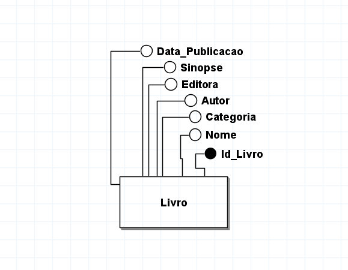
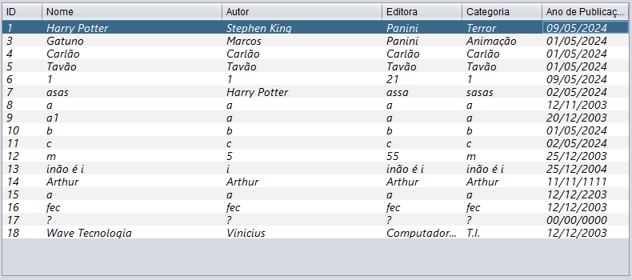
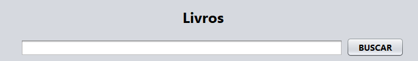
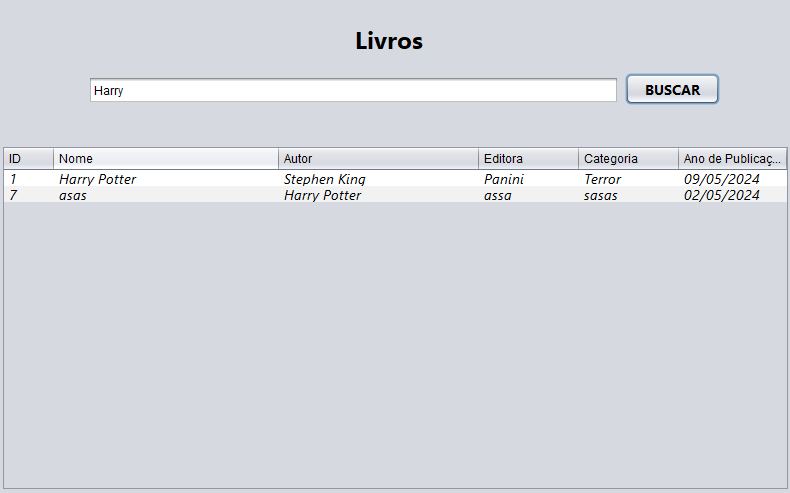
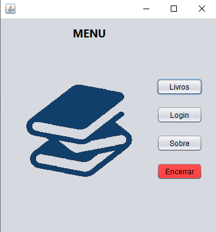

# Livroteca
## Sistema de Gerenciamento de Livros
No mundo existe bibliotecas IMENSAS que suportam em média de 200 MILHÕES de Livros, recebendo cerca de 8 mil livros por dia. Bibliotecas como: Biblioteca Nacional no Brasil ou a Biblioteca Nacional Marciana na Itália são uma dessas bibliotecas no qual não alugam e nem vende nenhum desses livros apenas os armazenam por fator cultural e histórico. A questão é que imagine a dificuldade em catalogar todos esses 8 mil livros diários, principalmente, em papeis físicos!
Seguindo essa demanda com propósito de facilitar o gerenciamento nessas bibliotecas foi feito um software modelo Desktop para realizar essa função.

## Como utilizar o sistema? ##
O sistema é bastante leve e deve funcionar em computadores e sistemas operacionais antigos, contudo, por ser em Java, é essencial instalá-lo [aqui](https://www.oracle.com/br/java/technologies/downloads/) junto do JDK [aqui.](https://www.java.com/pt-BR/download/manual.jsp) Além de um aplicativo como o [Xampp](https://www.apachefriends.org/pt_br/index.html) para fazer o banco de dados local.

## Ferramentas utilizadas ##
Este projeto foi feito a base de JAVA utilizando uma biblioteca de Java Swing no qual permite interfaces gráficas de usuário (GUI) em Java. O código foi feito usando o padrão arquitetura CRUD MVC! Esse padrão se baseia em reutilização de código aonde se divide o código em três (3) camadas: Model, Views e Control.

Além disso, o projeto ainda teve a utilização de Banco de Dados MySQL para gerar a tabela Livros aonde serão armazenados os dados dos livros do projeto. Na tabela Livro foram colocados os atributos: ID, Nome, Categoria, Autor, Editora, Sinopse e Data de Publicação, sendo o primeiro um atributo __chave__ conforme imagem abaixo do Modelo Conceitual.

  >

E o Modelo Lógico abaixo: 
 
 
  >
## Tabela ##
  >
  A listagem de livros é feito por meio de uma tabela (JTable). Os dados listados são ID, Nome do Livro, Autor, Editora, Categoria e Ano de Publicação, todos estes vem do banco de dados e são manipulados dentro do Java para ficarem na coluna correta de seus respectivos dados e para formatar a data para o modelo brasileiro (De AAAA/MM/dd para dd/MM/AAAA). Após isso, eles são inseridos na tabela.
## Barra de Pesquisa ##
  >
  Acima da tabela fica uma __barra de pesquisa__ aonde o usuário poderá pesquisar pelo nome do Livro, nome do Autor, Categoria, Editora ou ID do livro. Para isso, basta o usuário pesquisar o que deseja (exemplo na imagem abaixo) e clicar em __Buscar__ que o próprio sistema vai pesquisar no banco de dados essa palavra ou caractere.
>
Acima temos uma imagem mais completa mostrando a __tabela__ e a __barra de pesquisa__, nesse exemplo podemos ver que o usuário pesquisou na barra de pesquisa a palavra "Harry", no qual o sistema retornou com dois livros, um com "Harry" no nome do Livro e outro com "Harry" no nome do Autor. Para cancelar a pesquisa basta clicar no botão __Atualizar__ (não visível na imagem) aonde a tabela será atualizada e voltará para o normal ou deixar a barra de pesquisa em branco e clicar no botão __Buscar__.
## Sistema ##
### Menu ###
>
Esta é a primeira tela do sistema, nela terá 4 botões para o usuário escolher: botão __Livros__ que vai para a tela de listar livros para o usuário; botão __Login__ que vai para a tela de Login; botão __Sobre__ aonde o usuário poderá ver os desenvolvedores que desenvolveram o código e por último, o botão __Encerrar__ no qual encerra o sistema.
