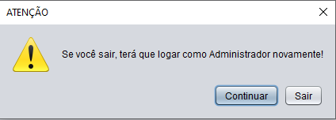

# Livroteca
## Sistema de Gerenciamento de Livros
No mundo existe bibliotecas IMENSAS que suportam em média de 200 MILHÕES de Livros, recebendo cerca de 8 mil livros por dia. Bibliotecas como: Biblioteca Nacional no Brasil ou a Biblioteca Nacional Marciana na Itália são uma dessas bibliotecas no qual não alugam e nem vende nenhum desses livros apenas os armazenam por fator cultural e histórico. A questão é que imagine a dificuldade em catalogar todos esses 8 mil livros diários, principalmente, em papeis físicos!
Seguindo essa demanda com propósito de facilitar o gerenciamento nessas bibliotecas foi feito um software modelo Desktop para realizar essa função.

## Como utilizar o sistema? ##
O sistema é bastante leve e deve funcionar em computadores e sistemas operacionais antigos, contudo, por ser em Java, é essencial instalá-lo [aqui](https://www.oracle.com/br/java/technologies/downloads/) junto do JDK [aqui.](https://www.java.com/pt-BR/download/manual.jsp) Além de um aplicativo como o [Xampp](https://www.apachefriends.org/pt_br/index.html) para fazer o banco de dados local.

## Ferramentas utilizadas ##
Este projeto foi feito a base de JAVA utilizando uma biblioteca de Java Swing no qual permite interfaces gráficas de usuário (GUI) em Java. O código foi feito usando o padrão arquitetura CRUD MVC! Esse padrão se baseia em reutilização de código aonde se divide o código em três (3) camadas: Model, Views e Control.

Além disso, o projeto ainda teve a utilização de Banco de Dados MySQL para gerar a tabela Livros aonde serão armazenados os dados dos livros do projeto. Na tabela Livro foram colocados os atributos: ID, Nome, Categoria, Autor, Editora, Sinopse e Data de Publicação, sendo o primeiro um atributo __chave__ conforme imagem abaixo do Modelo Conceitual.

  >

E o Modelo Lógico abaixo: 
 
 
  >
## Tabela ##
  >
  A listagem de livros é feito por meio de uma tabela (JTable). Os dados listados são ID, Nome do Livro, Autor, Editora, Categoria e Ano de Publicação, todos estes vem do banco de dados e são manipulados dentro do Java para ficarem na coluna correta de seus respectivos dados e para formatar a data para o modelo brasileiro (De AAAA/MM/dd para dd/MM/AAAA). Após isso, eles são inseridos na tabela.
## Barra de Pesquisa ##
  >
  Acima da tabela fica uma __barra de pesquisa__ aonde o usuário poderá pesquisar pelo nome do Livro, nome do Autor, Categoria, Editora ou ID do livro. Para isso, basta o usuário pesquisar o que deseja (exemplo na imagem abaixo) e clicar em __Buscar__ que o próprio sistema vai pesquisar no banco de dados essa palavra ou caractere.
>
Acima temos uma imagem mais completa mostrando a __tabela__ e a __barra de pesquisa__, nesse exemplo podemos ver que o usuário pesquisou na barra de pesquisa a palavra "Harry", no qual o sistema retornou com dois livros, um com "Harry" no nome do Livro e outro com "Harry" no nome do Autor. Para cancelar a pesquisa basta clicar no botão __Atualizar__ (não visível na imagem) aonde a tabela será atualizada e voltará para o normal ou deixar a barra de pesquisa em branco e clicar no botão __Buscar__.
## Sistema ##
### Menu ###
>
Esta é a primeira tela do sistema, nela terá 4 botões para o usuário escolher: botão __Livros__ que vai para a tela de listar livros para o usuário; botão __Login__ que vai para a tela de Login; botão __Sobre__ aonde o usuário poderá ver os desenvolvedores que desenvolveram o código e por último, o botão __Encerrar__ no qual encerra o sistema.
### Listagem do Usuário ###
>
Nesta tela é aonde estão a tabela e a barra de pesquisa para o usuário. Aqui, além de todas as funcionalidades citadas anteriormente na tabela e na barra de pesquisa, o usuário terá o botão __Atualizar__ aonde ele pode estar atualizando os dados da tabela ou via _Timer_ que atualizará automaticamente a tabela após os 10 primeiros segundos, primeiro 1 minuto e primeiros 10 minutos.
Na tela após selecionar um livro clicando nele na tabela, também temos o botão __Ver Mais__ que ao clicá-lo, será aberto uma tela aonde serão mostrados as informações desse livro (Abaixo nessa lista).
### Informações do Livro ###
>
Nesta tela, serão listados todos os dados do livro selecionado pelo usuário na tela anterior. Entre esses dados têmos o Nome do Livro, Nome do Autor, Categoria, Editora, Sinopse, Data de Publicação. Abaixo na tela têm um botão de __Voltar__ para voltar para a tela anterior.
### Sobre ###
>
Nesta tela são mostrados o Foto dos Desenvolvedores além de seus nomes e RA da faculdade.
### Login ###
>
Nesta tela o usuário poderá fazer login como Administrador para poder adicionar, alterar ou excluir dados dos livros. Para acessar, no campo do usuário deve-se colocar "Admin" (seja com a letra A maiúscula ou minúscula) e no campo "Senha" colocar "123". Caso o usuário tenha colocado de forma correta, aparecerá uma mensagem confirmando o _login_, caso contrário aparecerá uma mensagem de _erro_ informando login incorreto.
###  Listagem de Administrador ###
>
Esta tela tem as mesmas funcionalidades da tabela de listagem citada anteriormente, suas diferenças são a adição de: botão de __Criar__ aonde o _administrador_ vai pra tela de criar livros; botão __Alterar__, nesse caso o _administrador_ precisa selecionar o livro que deseja alterar seus dados e após isso clicar nesse botão para ir a uma tela aonde poderá alterar os dados dos livros; botão __Excluir__ que segue o mesmo padrão do botão __Alterar__. O usuário deve selecionar o livro que deseja que seja deletado e por fim clicar no botão que pedirá uma confirmação para realizar a exclusão desse livro. Por último, no botão __Ver Mais__ tem a mesma função do Ver mais do usuário! É aberto uma tela aonde mostra as informações do livro selecionado como mostrado abaixo.
>
No botão __Sair__, o sistema emitirá uma mensagem avisando que o usuário sairá da tela de Administrador e precisará fazer login novamente caso saia, então fica a escolha de sair ou ficar na tela para o usuário.
### Exclusão de Livros ###
>
Após selecionar o livro desejado e clicar no botão __Deletar__, o sistema mostra essa tela acima! Tela no qual pede confirmação do administrador se ele realmente deseja deletar o livro. Caso o administrador clique em __Cancelar__, nada será feito. Agora, caso o administrador clique em __Excluir__, o livro será deletado por completo.
### Alteração de Dados dos Livros ###
>
Após o administrador selecionar o livro desejado e clicar em __Alterar__, o sistema mostra a tela acima! Nesta tela serão mostrados todos os dados do livro selecionado, como: Nome do Livro, Nome do Autor, Categoria, Editora, Data de Publicação e Sinopse. Para alterar, basta o administrador clicar no campo que deseja alterar e depois clicar em __Alterar__! Agora, caso o administrador mude de idéia, basta clicar em __Voltar__ que quaisquer alterações serão canceladas.
Obs: como alguns campos NÃO podem ficar vazios no banco de dados como o nome do livro, por exemplo; o sistema contornará a caixa de digitação com uma linha vermelha que sumirá apenas quando o administrador clicar em cima!
Obs 2: Caso o administrador exceda o número de caracteres permitidos em uma caixa de digitação, exemplo: o nome do livro ultrapassar 60 caracteres, será emitido uma mensagem de erro pedindo para que o administrador reduza a quantidade de caracteres nessa caixa de digitação.
### Criação de Livros ###
>
Nesta tela é aonde serão criados os livros. Aqui o Administrador coloca nome do Livro, nome do Autor, Categoria, Editora, Data de Publicação e Sinopse do livro, lembrando que este último é o único campo que pode ficar vazio. Caso os outros campos estejam vazios será emitido uma mensagem com erro pedindo para que o administrador adicione algum valor para o campo.
Caso o administrador exceda o limite de caracteres em um campo, será retornado uma mensagem de erro pedindo para que apague alguns desses caracteres. Exemplo: se o Nome exceder 60 caracteres, será emitido essa mensagem.
Após o administrador preencher todos os dados do livro, basta clicar em __Criar__ que se estiver tudo correto, o livro será criado. Caso mude de ideia, basta clicar em __Voltar__ que nenhum livro será criado.
### Deslogar como Administrador ###
>
Caso o _administrador_ clique no botão __Sair__ na tela de Listagem como administrador, aparecerá uma caixa de diálogo pedindo uma confirmação do _administrador_ (mostrado acima) se ele têm certeza que quer deslogar e que precisará fazer login de novo para acessar essa tela novamente.
## Agradecimentos ##
Gostaría de agradecer a todos vocês que leram até aqui e puderam ver um pouco desse projeto! Pretendo melhorá-lo com o tempo para alcançar níveis maiores de satisfação. Caso tenha gostado, não esquece de deixar aquela __ESTRELINHA__ no código para alcançar mais e mais gente :)
